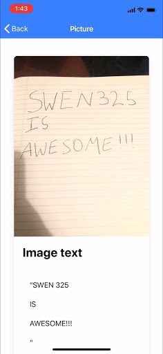

# What Text
An OCR image recognition app written in Ionic, Angular and TypeScript, created as a project for SWEN325 - Mobile App Design.

Due to time constraints, this was not anywhere near as polished as I had intended. It turned out to be a far more ambitious project than I had initially stipulated, however, I still had a tonne of fun learning how to piece my ideas together. 

The name has a funny story behind it - we were given a week to come up with an idea for a mobile app and write a plan for its development. I knew I wanted to do something with computer vision, and I found an API for cat breed classification called [What Cat](https://metadata.co.jp/apis/what-cat.html). As the API is almost entirely in Japanese, Google Translate was my best friend when trying to get this to work, and the name translated to "This Cat What Cat". After spending a week trying to get the API to return meaningful JSON and reverse engineering the web app that uses the service with my SWEN325 professor, he suggested I choose another idea. I landed on an OCR app for text recognition using Google's Cloud Vision API, and thankfully, this API actually worked. As a tongue in cheek gesture to the week I spent trying to get this cat API to work, I named the OCR app "This Text What Text", which I was suggested to change to the more succinct "What Text".

